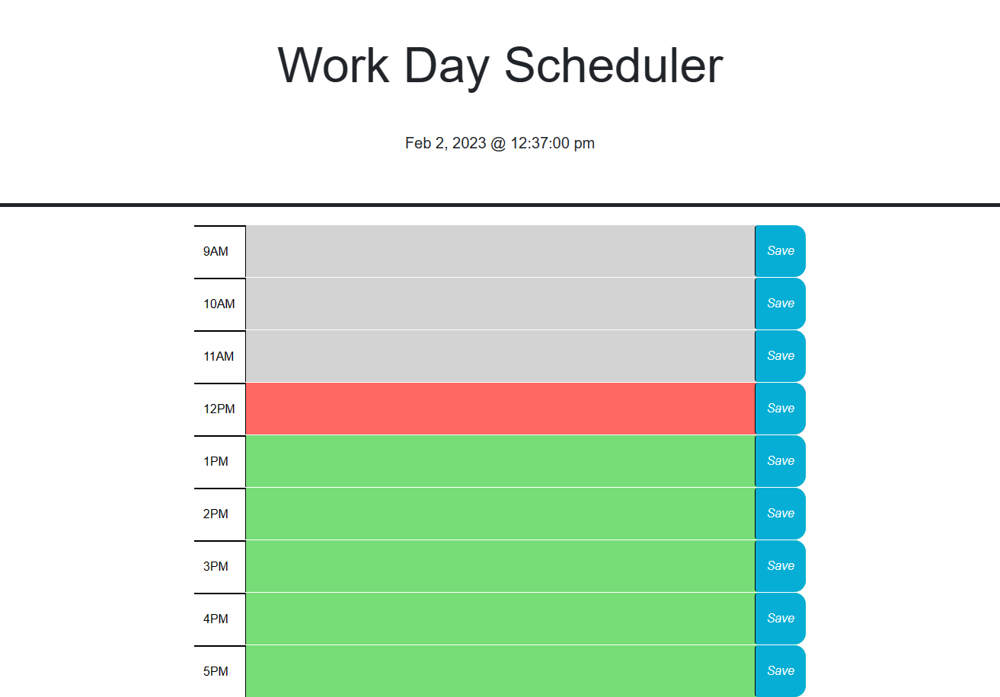

# Jessies-workday-scheduler

## In this project I utilized what we've learned about Jquery and Bootstrap to create a dynamic workday scheduler. It has a day and time counter at the top. It checks to see the current time vs the time of the hour blocks and colors them depending on wether its past present or future. You can save your schedule in local storage for later.

https://karlfranzia.github.io/Jessies-workday-scheduler/